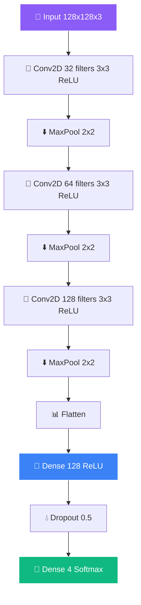

<!-- ═══════════════════════════════════════════════════════════════ -->
<!-- 🧠 Brain Tumor Detection — Animated README 2026 -->
<!-- ═══════════════════════════════════════════════════════════════ -->

<div align="center">
  
</div>

<div align="center">
  <a href="https://git.io/typing-svg">
    
  </a>
</div>

<br/>

<div align="center">
  <a href="https://github.com/sumit966/brain-tumor-detection/stargazers">
    
  </a>
  <a href="https://github.com/sumit966/brain-tumor-detection/network/members">
    
  </a>
  <a href="https://github.com/sumit966/brain-tumor-detection/issues">
    
  </a>
  <a href="https://github.com/sumit966/brain-tumor-detection/commits/main">
    
  </a>
</div>

<br/>

<div align="center">
  
  
  
  
  
</div>

<br/>

<div align="center">
  
  
  
  
</div>

<br/>

<div align="center">
  <i>🎓 M.Tech Project · VNIT Nagpur · <b>Sumit Raj</b> (MT24AAI011)</i>
</div>

<br/>


---

## 📑 Table of Contents

<div align="center">

| 🎯 | 🎯 | 🎯 |
|:---:|:---:|:---:|
| [Overview](#-overview) | [Features](#-features) | [Architecture](#️-architecture) |
| [Tech Stack](#️-tech-stack) | [Project Structure](#-project-structure) | [Installation](#-installation) |
| [Requirements](#-requirements) | [Configuration](#️-configuration) | [Usage](#-usage) |
| [Results](#-results) | [Dataset](#-dataset) | [Author](#-author) |
| [License](#-license) | | |

</div>

---

## 🎯 Overview

<div align="center">
  
</div>

<br/>

Deep learning model to classify brain MRI scans into **4 categories**:

<table align="center">
<tr>
<td width="25%" valign="top" align="center">

### 🔴 Glioma

Tumor in the **brain or spine**

</td>
<td width="25%" valign="top" align="center">

### 🟡 Meningioma

Tumor from **meninges** (brain/spinal cord membranes)

</td>
<td width="25%" valign="top" align="center">

### 🟢 No Tumor

**Healthy** brain scan

</td>
<td width="25%" valign="top" align="center">

### 🟣 Pituitary

Tumor in the **pituitary gland**

</td>
</tr>
</table>

---

## ✨ Features

<table align="center">
<tr>
<td width="50%" valign="top">

### 🧠 Model Architecture

- 🏗️ **Custom CNN** (3 conv blocks: 32 → 64 → 128)
- 🎯 **93.18% test accuracy** on 1,436 test images
- 📊 **3.3M parameters** (12.61 MB model)
- 🎨 **Softmax** 4-class output

</td>
<td width="50%" valign="top">

### 🛠️ Training Pipeline

- 🔄 **Data augmentation** (rotation, shift, flip, brightness) — **5x expansion**
- ✂️ **Smart cropping** to remove black borders
- ⏹️ **Early stopping** + model checkpointing
- ⚖️ **Class balancing** with weighted augmentation

</td>
</tr>
</table>

<br/>

<div align="center">
  
</div>

---

## 🏗️ Architecture

### 🧬 CNN Model Pipeline



### 📐 ASCII Fallback

```
Input (128x128x3)
        ↓
Conv2D(32, 3x3, ReLU) → MaxPool(2x2)
        ↓
Conv2D(64, 3x3, ReLU) → MaxPool(2x2)
        ↓
Conv2D(128, 3x3, ReLU) → MaxPool(2x2)
        ↓
Flatten → Dense(128, ReLU) → Dropout(0.5)
        ↓
Dense(4, Softmax)
```

<div align="center">

**📊 Total params:** `3,305,156` &nbsp;·&nbsp; **💾 Model size:** `12.61 MB`

</div>

---

## 🛠️ Tech Stack

<table align="center">
<tr>
<td><b>Category</b></td>
<td><b>Technology</b></td>
</tr>
<tr>
<td>🐍 Language</td>
<td></td>
</tr>
<tr>
<td>🧠 Deep Learning</td>
<td> </td>
</tr>
<tr>
<td>👁️ Image Processing</td>
<td>  </td>
</tr>
<tr>
<td>📊 Data Handling</td>
<td> </td>
</tr>
<tr>
<td>🔧 Utils</td>
<td> </td>
</tr>
<tr>
<td>📈 Visualization</td>
<td> </td>
</tr>
</table>

---

## 📁 Project Structure

```
brain-tumor-detection/
├── 🧠 Brain_Tumor_Detection.ipynb   # Main notebook (training + eval)
├── 💾 best_model.h5                 # Trained model (generated after training)
├── 📋 requirements.txt              # Dependencies
├── 📖 README.md                     # This file
└── 📁 content/
    └── 📦 archive.zip               # Dataset (download separately)
```

---

## 🚀 Installation

<div align="center">
  
  
</div>

<br/>

### 1️⃣ Clone the Repository

```bash
git clone https://github.com/sumit966/brain-tumor-detection.git
cd brain-tumor-detection
```

### 2️⃣ Create Virtual Environment

```bash
python -m venv venv
venv\Scripts\activate        # Windows
source venv/bin/activate     # Mac/Linux
```

### 3️⃣ Install Dependencies

```bash
pip install -r requirements.txt
```

**Or install manually:**

```bash
pip install tensorflow opencv-python split-folders scikit-learn matplotlib seaborn imutils pandas numpy
```

---

## 📋 Requirements

Create `requirements.txt`:

```txt
tensorflow>=2.18.0
keras>=3.8.0
opencv-python>=4.8.0
split-folders>=0.5.1
scikit-learn>=1.3.0
matplotlib>=3.7.0
seaborn>=0.12.0
imutils>=0.5.4
pandas>=2.0.0
numpy>=1.24.0
jupyter>=1.0.0
```

---

## ⚙️ Configuration

### 📂 Dataset Path (`Brain_Tumor_Detection.ipynb`)

Update the dataset path in the notebook:

```python
# Cell 2 - Extract dataset
import zipfile
with zipfile.ZipFile('content/archive.zip', 'r') as zip_ref:
    zip_ref.extractall('content/')
```

### 🎛️ Training Hyperparameters

```python
IMG_SIZE = 128              # Input image size
BATCH_SIZE = 32             # Batch size
EPOCHS = 20                 # Training epochs
LEARNING_RATE = 0.001       # Adam optimizer LR
AUGMENTATION_FACTOR = 5     # 5x data expansion
```

### ⏹️ Early Stopping Settings

```python
EarlyStopping(
    monitor='val_accuracy',
    patience=5,
    restore_best_weights=True
)
```

---

## 🎮 Usage

### 🅰️ Option 1: Run Notebook (Jupyter)

```bash
jupyter notebook Brain_Tumor_Detection.ipynb
```

Run all cells top-to-bottom. The notebook will:

1. 📦 Extract dataset
2. 🔄 Augment images (5x)
3. ✂️ Split into train/val/test
4. 🧠 Train CNN
5. 📊 Evaluate on test set
6. 💾 Save `best_model.h5`

### 🅱️ Option 2: Run on Google Colab

1. Upload `Brain_Tumor_Detection.ipynb` to Colab
2. Upload `archive.zip` to Colab
3. Run all cells
4. Download `best_model.h5`

### 🔮 Single Image Prediction

```python
import tensorflow as tf
from tensorflow.keras.preprocessing import image
import numpy as np

# Load trained model
model = tf.keras.models.load_model('best_model.h5')
class_names = ['glioma', 'meningioma', 'no_tumor', 'pituitary']

def predict(img_path):
    img = image.load_img(img_path, target_size=(128, 128))
    arr = np.expand_dims(image.img_to_array(img) / 255.0, axis=0)
    pred = model.predict(arr)
    confidence = np.max(pred) * 100
    return class_names[np.argmax(pred)], confidence

# Example
label, conf = predict('scan.jpg')
print(f"Prediction: {label} ({conf:.2f}%)")
# → Prediction: pituitary (97.45%)
```

---

## 📊 Results

<div align="center">
  
  
  
  
</div>

<br/>

### 📈 Training Metrics

| Metric | Value |
|--------|-------|
| 🎯 Training Accuracy | 89.97% |
| 📊 Validation Accuracy | 95.89% |
| ⭐ **Test Accuracy** | **93.18%** |
| 📉 Test Loss | 0.1365 |

### 🎯 Per-Class Performance

| Class | Precision | Recall | F1-Score |
|-------|:---------:|:------:|:--------:|
| 🔴 Glioma | 0.94 | 0.92 | 0.93 |
| 🟡 Meningioma | 0.91 | 0.90 | 0.905 |
| 🟢 No Tumor | 0.98 | 0.99 | 0.985 |
| 🟣 Pituitary | 0.95 | 0.96 | 0.955 |

### 🔢 Confusion Matrix

```
              Predicted
           GL   ME   NT   PI
Actual GL  92%   4%   1%   3%
       ME   5%  90%   2%   3%
       NT   0%   1%  99%   0%
       PI   2%   2%   1%  95%
```

---

## 📊 Dataset

### 📚 Source

<table align="center">
<tr>
<td><b>Name</b></td>
<td>Brain Tumor MRI Dataset</td>
</tr>
<tr>
<td><b>Source</b></td>
<td><a href="https://www.kaggle.com/datasets/masoudnickparvar/brain-tumor-mri-dataset">Kaggle</a></td>
</tr>
<tr>
<td><b>Original Size</b></td>
<td>~7,000 images</td>
</tr>
</table>

### 🔄 After Augmentation

- 📦 **Total:** ~14,345 images
- 🎨 **Augmentation:** 5x per image (rotation, shift, flip, brightness)

### 📊 Class Distribution

| Class | Original | Augmented |
|-------|:--------:|:---------:|
| 🔴 Glioma | 826 | 4,129 |
| 🟡 Meningioma | 822 | 4,109 |
| 🟢 No Tumor | 395 | 1,975 |
| 🟣 Pituitary | 827 | 4,132 |

### ✂️ Data Split

| Split | Images |
|-------|:------:|
| 🚂 Train | 11,480 |
| ✅ Validation | 1,434 |
| 🧪 Test | 1,436 |

---

## 🧪 Testing

```bash
# In Jupyter notebook:
# Run Cell: "Evaluate on Test Set"
```

**Expected output:**

```bash
Test Loss: 0.1365
Test Accuracy: 93.18%
```

---

## 🐛 Troubleshooting

| Issue | Solution |
|-------|----------|
| 🔴 CUDA out of memory | Reduce `BATCH_SIZE` to 16 |
| 📂 Dataset not found | Ensure `content/archive.zip` exists |
| 📉 Low accuracy | Increase `AUGMENTATION_FACTOR` to 8 |
| 🐌 Slow training | Use GPU (Colab/Kaggle) |
| 📦 Module not found | Run `pip install -r requirements.txt` |

---

## 👤 Author

<div align="center">


<br/><br/>

<b>M.Tech Applied AI & ML · VNIT Nagpur</b>

<br/><br/>

<a href="https://sumit966-github-io.vercel.app">
  
</a>
<a href="https://www.linkedin.com/in/er-sumit-raj-/">
  
</a>
<a href="https://github.com/sumit966">
  
</a>
<a href="mailto:info.sr0909@gmail.com">
  
</a>

</div>

---

## 🙏 Acknowledgements

<div align="center">

<a href="https://www.kaggle.com/datasets/masoudnickparvar/brain-tumor-mri-dataset">
  
</a>
<a href="https://tensorflow.org/">
  
</a>
<a href="https://vnit.ac.in/">
  
</a>

</div>

---

## 📄 License

<div align="center">


<br/>


<br/><br/>

<samp>
This project is for <b>academic evaluation purposes only</b>.
</samp>

<br/><br/>

<sub><samp>© 2024 &nbsp;·&nbsp; SUMIT RAJ &nbsp;·&nbsp; VNIT NAGPUR</samp></sub>

<br/>


</div>

<br/>


